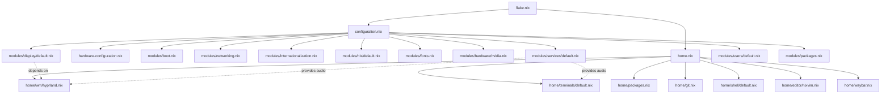

# NixOS Modular Configuration

A modern, high-performance NixOS configuration with comprehensive development tools, AI/ML capabilities, and beautiful theming.

[](https://nixos.org)
[](https://hyprland.org)

## Features

### Desktop Environment
- **Hyprland** - Dynamic tiling Wayland compositor with beautiful animations
- **SDDM** - Simple Desktop Display Manager with custom Astronaut theme
- **Waybar** - Customizable status bar with Catppuccin styling
- **Stylix** - System-wide theming with base16 color schemes

### Development Environment
- **Neovim (Nixvim)** - Fully configured with:
  - LSP servers for Python, TypeScript, Rust, and Nix
  - Auto-completion with nvim-cmp
  - Code formatting (black, nixfmt, prettier)
  - Git integration with inline blame
  - Telescope fuzzy finder
  - Session management
- **Shell** - Bash with Starship prompt and Zoxide for smart navigation
- **Terminal** - Kitty with Nerd Fonts and beautiful styling

### Gaming & AI
- **Steam** - Native gaming support
- **llama-cpp-cuda** - Local LLM inference with CUDA acceleration
- **NVIDIA Drivers** - Optimized for gaming and ML workloads

## Architecture

This configuration uses a **modular architecture** that separates system and user configurations:

### Directory Structure

```
nixos-config/
├── flake.nix                      # Main flake with inputs and outputs
├── configuration.nix              # System configuration entry point
├── hardware-configuration.nix     # Hardware-specific (not tracked)
├── home.nix                       # Home Manager entry point
│
├── modules/                       # System-level modules
│   ├── boot.nix                  # systemd-boot, EFI
│   ├── display/default.nix       # Wayland, SDDM, Hyprland
│   ├── fonts.nix                 # Font configuration
│   ├── hardware/nvidia.nix       # GPU drivers and power management
│   ├── internationalization.nix  # Locale, timezone, keyboard
│   ├── networking.nix            # NetworkManager, hostname
│   ├── nix/default.nix          # Nix settings and optimizations
│   ├── packages.nix              # System packages
│   ├── services/default.nix      # Pipewire, Steam, SSH
│   └── users/default.nix         # User accounts
│
└── home/                          # Home Manager modules
    ├── editor/nixvim.nix         # Neovim configuration
    ├── git.nix                   # Git settings
    ├── packages.nix              # User packages
    ├── shell/default.nix         # Bash, Starship, Zoxide
    ├── terminals/default.nix     # Kitty, Tofi
    ├── waybar.nix                # Status bar config
    └── wm/hyprland.nix           # Window manager settings
```

### Modularization Graph



## Quick Start

### Requirements
- NixOS with Flakes enabled
- NVIDIA GPU (configured for RTX/RTX Super series)
- 24GB+ RAM recommended (for AI/ML workloads)
- UEFI firmware

### Installation

1. **Clone the repository:**
   ```bash
   git clone <your-repo-url> ~/nixos-config
   cd ~/nixos-config
   ```

2. **Generate hardware configuration:**
   ```bash
   sudo nixos-generate-config --root /mnt
   # Copy /mnt/etc/nixos/hardware-configuration.nix to this directory
   ```

3. **Update flake inputs:**
   ```bash
   nix flake update
   ```

4. **Build and switch:**
   ```bash
   sudo nixos-rebuild switch --flake .#nixos
   ```

### Daily Usage

**Apply configuration changes:**
```bash
sudo nixos-rebuild switch --flake .#nixos
```

**Test without applying:**
```bash
sudo nixos-rebuild test --flake .#nixos
```

**Update flake inputs:**
```bash
nix flake update
```

**Garbage collection:**
```bash
sudo nix-collect-garbage -d
nix-store --optimize
```

## Customization

### Adding System Packages

Edit `modules/packages.nix`:
```nix
environment.systemPackages = with pkgs; [
  # Your packages here
  my-package
];
```

### Adding User Packages

Edit `home/packages.nix`:
```nix
home.packages = with pkgs; [
  # Your packages here
  my-package
];
```

### Adding a New System Module

1. Create `modules/my-module.nix`:
   ```nix
   { config, pkgs, ... }:
   {
     # Your configuration
   }
   ```

2. Import in `configuration.nix`:
   ```nix
   imports = [
     # ...
     ./modules/my-module.nix
   ];
   ```

### Adding a New Home Module

1. Create `home/my-module.nix`:
   ```nix
   { config, pkgs, ... }:
   {
     # Your configuration
   }
   ```

2. Import in `home.nix`:
   ```nix
   imports = [
     # ...
     ./home/my-module.nix
   ];
   ```

### Changing the Theme

The system uses **Stylix** for theming. Change the base color scheme in `flake.nix`:

```nix
stylix.base16Scheme = "${pkgs.base16-schemes}/share/themes/catppuccin-mocha.yaml";
```

Or set a custom background:
```nix
stylix.image = ./path/to/your/image.png;
```

## Key Bindings

### Hyprland (Window Manager)

| Key | Action |
|-----|--------|
| `SUPER + RETURN` | Open terminal (Kitty) |
| `SUPER + SPACE` | Open application launcher (Tofi) |
| `SUPER + B` | Open browser (Firefox) |
| `SUPER + W` | Close window |
| `SUPER + 1-9` | Switch to workspace |
| `SUPER + SHIFT + 1-9` | Move window to workspace |
| `PRINT` | Screenshot (grimblast copy area) |
| `XF86AudioRaiseVolume` | Volume up |
| `XF86AudioLowerVolume` | Volume down |
| `XF86AudioMute` | Toggle mute |
| `XF86AudioMicMute` | Toggle microphone mute |

### Neovim

The Neovim configuration uses default plugin keybindings. Available commands:

**Telescope (Fuzzy Finder):**
- `:Telescope find_files` - Find files
- `:Telescope live_grep` - Search in files
- `:Telescope buffers` - List buffers
- `:Telescope help_tags` - Search help

**LSP (Language Server):**
- `gd` - Go to definition
- `gr` - Find references
- `K` - Hover documentation
- `gi` - Go to implementation
- `go` - Go to type definition

**Other:**
- `:Neotree toggle` - Toggle file explorer
- `:SessionSave` - Save session
- `:SessionLoad` - Load session

## Module Reference

### System Modules

#### `modules/nix/default.nix`
- Enables Flakes and nix-command
- Configures parallel evaluation (`eval-cores = 0`)
- Sets up substituters (Cachix, Determinate)
- Configures garbage collection
- Limits nix-daemon memory to 24GB

#### `modules/hardware/nvidia.nix`
- Installs NVIDIA stable drivers
- Enables mode setting
- Creates TDP limiting service (125W)
- Supports architectures: 60, 75, 80, 86

#### `modules/display/default.nix`
- Configures SDDM with Astronaut theme
- Sets up Hyprland as default session
- Italian keyboard layout
- Wayland-only (no X11)

#### `modules/services/default.nix`
- PipeWire audio with PulseAudio compatibility
- EarlyOOM (memory management at 90%)
- Fstrim (SSD optimization weekly)
- CUPS (printing)
- Steam gaming platform
- SSH agent

### Home Modules

#### `home/editor/nixvim.nix`
- Catppuccin color scheme
- LSP: pyright, ts_ls, rust_analyzer, nixd
- Completion: nvim-cmp with LSP, path, buffer
- Formatting: black, nixfmt, prettier
- Plugins: Telescope, Neo-tree, Git integration
- Session management with persistence.nvim

#### `home/wm/hyprland.nix`
- Default mod key: SUPER
- Gap settings: inner=5, outer=20
- Tiling behavior with smart gaps
- Application rules for Steam and Discord

#### `home/waybar.nix`
- Left: logo, workspaces
- Center: clock, window title
- Right: system tray, audio, network, CPU, memory, battery
- Catppuccin styling with CSS modules

## Module Dependencies

### System Modules
- **Core Infrastructure** (loaded first):
  - `hardware-configuration.nix`
  - `modules/nix/default.nix`
  - `modules/boot.nix`
  - `modules/networking.nix`
  - `modules/users/default.nix`

- **Hardware Support** (depends on core):
  - `modules/hardware/nvidia.nix`
  - `modules/display/default.nix`
  - `modules/fonts.nix`

- **System Services** (depends on core and hardware):
  - `modules/services/default.nix`
  - `modules/packages.nix`

### Home Modules
- **User Environment** (independent):
  - `home/packages.nix`
  - `home/git.nix`
  - `home/shell/default.nix`
  - `home/terminals/default.nix`

- **Desktop Environment** (depends on system):
  - `home/editor/nixvim.nix`
  - `home/wm/hyprland.nix`
  - `home/waybar.nix`

## Credits

- **NixOS** - The purely functional Linux distribution
- **Home Manager** - User configuration management
- **Hyprland** - Dynamic tiling Wayland compositor
- **Stylix** - System-wide theming
- **NixVim** - Neovim configuration with Nix
- **Catppuccin** - Beautiful color scheme

## License

This configuration is provided as-is for personal use. Feel free to adapt and modify.

## Author

**Nicola Destro**
- Email: [nicolade03@gmail.com](mailto:nicolade03@gmail.com)
- GitHub: [@Trisert](https://github.com/Trisert)
